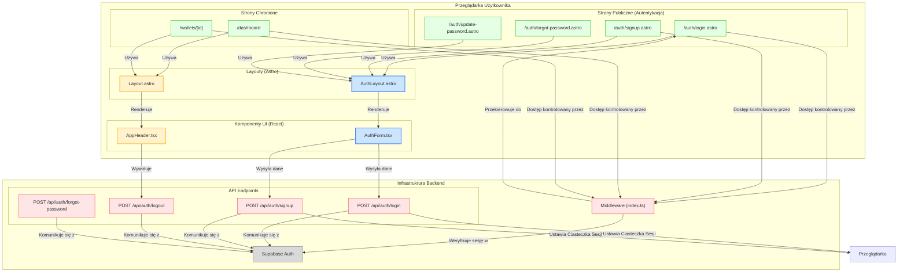

<architecture_analysis>
Na podstawie dostarczonej dokumentacji (`prd.md`, `auth-spec.md`) oraz analizy struktury kodu, przedstawiam analizę architektury UI dla modułu autentykacji.

### 1. Lista Komponentów i Stron

Zidentyfikowano następujące elementy, które są częścią lub zostaną utworzone w ramach modułu autentykacji:

**Strony (Astro):**
- `/src/pages/auth/login.astro`: Strona logowania (istniejąca jako `/signin.astro`).
- `/src/pages/auth/signup.astro`: Strona rejestracji (istniejąca jako `/signup.astro`).
- `/src/pages/auth/forgot-password.astro`: Strona do odzyskiwania hasła (nowa).
- `/src/pages/auth/update-password.astro`: Strona do aktualizacji hasła po odzyskaniu (nowa).
- `/src/pages/dashboard`: Główna strona aplikacji po zalogowaniu (chroniona).
- `/src/pages/wallets/[...slug].astro`: Strona szczegółów portfela (chroniona).

**Layouty (Astro):**
- `src/layouts/AuthLayout.astro`: Nowy layout dla stron autentykacji, o prostszej strukturze bez nawigacji aplikacji.
- `src/layouts/Layout.astro`: Główny layout aplikacji, który zostanie zaktualizowany, aby obsługiwać stan zalogowanego/niezalogowanego użytkownika. W dokumentacji nazwany `AppLayout.astro`.

**Komponenty (React):**
- `src/components/AuthForm.tsx`: Współdzielony, kliencki komponent formularza dla logowania i rejestracji.
- `src/components/AppHeader.tsx`: Istniejący komponent nagłówka, który zostanie zaktualizowany, aby dynamicznie pokazywać stan uwierzytelnienia (linki "Zaloguj", "Zarejestruj" lub email użytkownika i przycisk "Wyloguj").

**Logika Backendowa (API & Middleware):**
- `src/middleware/index.ts`: Middleware przechwytujący żądania, weryfikujący sesję użytkownika i chroniący trasy.
- `API Endpoints (/src/pages/api/auth/*)`: Zestaw endpointów do obsługi logiki rejestracji, logowania, wylogowywania i resetowania hasła.

### 2. Główne Strony i Ich Komponenty

- **Strony autentykacji (`/auth/*`):**
  - Używają `AuthLayout.astro`.
  - `login.astro` i `signup.astro` renderują komponent `AuthForm.tsx` z odpowiednim trybem (`'login'` lub `'signup'`).
  - `forgot-password.astro` i `update-password.astro` będą zawierać własne, dedykowane formularze React.

- **Strony chronione (`/dashboard`, `/wallets/*`):**
  - Używają `Layout.astro`.
  - Dostęp do nich jest kontrolowany przez `middleware/index.ts`.
  - `Layout.astro` renderuje zaktualizowany `AppHeader.tsx`, który otrzymuje informacje o sesji użytkownika.

### 3. Przepływ Danych

1.  **Użytkownik anonimowy:**
    - Wchodzi na stronę `/auth/login` lub `/auth/signup`.
    - `AuthForm.tsx` zarządza stanem formularza i walidacją po stronie klienta.
    - Po wysłaniu formularza, żądanie trafia do odpowiedniego endpointu API (`/api/auth/login` lub `/api/auth/signup`).
    - Endpoint API komunikuje się z Supabase, a w odpowiedzi ustawia w przeglądarce ciasteczka sesji (`HttpOnly`).
    - Po pomyślnej autentykacji, użytkownik jest przekierowywany na `/dashboard`.

2.  **Użytkownik zalogowany:**
    - Gdy próbuje uzyskać dostęp do dowolnej strony, `middleware/index.ts` jest uruchamiany.
    - Middleware odczytuje ciasteczka sesji, weryfikuje je w Supabase i umieszcza dane użytkownika w `Astro.locals.user`.
    - Jeśli użytkownik próbuje wejść na stronę chronioną (np. `/dashboard`), middleware pozwala na dostęp.
    - Jeśli użytkownik próbuje wejść na stronę logowania (`/auth/login`), middleware przekierowuje go na `/dashboard`.
    - Dane o użytkowniku z `Astro.locals` są przekazywane do `Layout.astro`, a następnie do `AppHeader.tsx`, który renderuje odpowiedni widok.

### 4. Opis Funkcjonalności Komponentów

- **`AuthLayout.astro`**: Zapewnia minimalistyczny interfejs dla formularzy, skupiając uwagę użytkownika na procesie logowania/rejestracji.
- **`Layout.astro`**: Główny szablon aplikacji, zawiera nawigację i stopkę; dostosowuje `AppHeader` do stanu sesji.
- **`AuthForm.tsx`**: Centralizuje logikę formularzy logowania i rejestracji, w tym walidację i komunikację z API. Zmniejsza duplikację kodu.
- **`AppHeader.tsx`**: Działa jako główny punkt nawigacyjny i wskaźnik stanu sesji użytkownika.
- **`middleware/index.ts`**: Pełni rolę strażnika aplikacji, chroniąc zasoby i zarządzając sesją na poziomie serwera przy każdym żądaniu.

</architecture_analysis>

<mermaid_diagram>

</mermaid_diagram>
